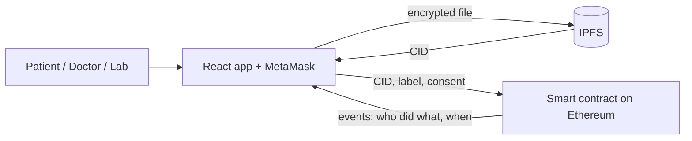

# BlockCare: A Blockchain-Enabled Secured EHR System

BlockCare is a health-record system where **the patient owns the data**. Files are encrypted in the browser, stored on **IPFS**, and tracked on **Ethereum** by a smart contract that decides who can see what. Doctors and labs get in only when the patient says yes, and every step is written to the blockchain.

This project is a working implementation of the system described in our published paper (see [Paper](#paper)).


## Features

- **Role-based access** for four kinds of users: Admin, Patient, Doctor, and Diagnostic Lab
- **Patient-controlled consent**: doctors and labs must request access, and the patient allows or removes it at any time
- **Browser-side encryption**: files are locked with AES-GCM before they leave the computer
- **Decentralised file storage** on IPFS, with only the file ID (CID) saved on-chain
- **Lab results**: an approved lab can add results to a patient's record without being able to read the other files
- **Audit trail**: the patient's Activity list is built from blockchain events (access requested, granted, removed, record added) with timestamps
- **Automated tests** for the smart contract rules

## How it works



1. The patient picks a file and a password. The browser locks the file (AES-GCM, key derived from the password with PBKDF2).
2. The locked file is uploaded to IPFS, which returns a CID.
3. The CID, a label, the uploader, and a timestamp are saved by the smart contract.
4. A doctor asks for access. The patient allows it in the contract.
5. The doctor reads the list of records from the contract, fetches the locked file from IPFS, and unlocks it with the password the patient shared.

### Roles

| Role | What they can do |
|---|---|
| **Admin** | Approves and removes doctors and labs (the account that deployed the contract) |
| **Patient** | Signs up, uploads records, allows or removes access, sees the activity log |
| **Doctor** | Asks for access, reads a patient's records after the patient allows it |
| **Diagnostic Lab** | Asks for permission, adds results to a patient's record after the patient allows it. Cannot read records |

## Tech stack

| Part | Tool |
|---|---|
| Smart contract | Solidity 0.8.19 |
| Dev, test, and deploy | Truffle v5 |
| Local blockchain | Ganache (desktop app), port 7545, network ID 5777 |
| File storage | IPFS (IPFS Desktop / Kubo) |
| Frontend | React (Vite), ethers v6 |
| Wallet | MetaMask |
| Encryption | Web Crypto API (AES-GCM, PBKDF2-SHA256, 100,000 iterations) |

## Project structure

```
blockcare/
├── contracts/
│   └── Blockcare.sol            # smart contract (roles, records, access)
├── migrations/
│   └── 1_deploy_blockcare.js    # deploy script
├── test/
│   └── BlockCare.test.js        # contract tests
├── frontend/
│   └── src/
│       ├── App.jsx              # the web app
│       ├── index.css            # styles
│       └── BlockCare.json       # contract file copied from build/contracts
├── truffle-config.js
├── start-demo.bat               # starts the website (Windows)
└── reset-contract.bat           # redeploys the contract and copies the file (Windows)
```

## Getting started

### Prerequisites

- [Node.js](https://nodejs.org/) (tested with v22; v16 or v18 also works)
- Truffle: `npm install -g truffle`
- [Ganache](https://archive.trufflesuite.com/ganache/) desktop app
- [IPFS Desktop](https://docs.ipfs.tech/install/ipfs-desktop/)
- [MetaMask](https://metamask.io/) browser extension

### 1. Get the code

```
git clone https://github.com/<your-username>/blockcare.git
cd blockcare
cd frontend
npm install
cd ..
```

### 2. Start Ganache

Create a **New Workspace** (Ethereum) and save it. Check that the server is `127.0.0.1`, port `7545`, and network ID `5777`.

### 3. Allow the website to talk to IPFS

In IPFS Desktop, go to **Settings → Kubo config** and set the API headers, then save and restart IPFS:

```json
"API": {
  "HTTPHeaders": {
    "Access-Control-Allow-Origin": ["http://localhost:5173", "http://127.0.0.1:5173"],
    "Access-Control-Allow-Methods": ["PUT", "POST", "GET"]
  }
}
```

### 4. Set up MetaMask

1. Add a custom network: name `Ganache`, RPC URL `http://127.0.0.1:7545`, Chain ID `1337`, symbol `ETH`.
2. Import four Ganache accounts (use the key icon in Ganache) and name them `admin`, `patient`, `doctor`, `lab`. The first Ganache account is the admin because it deploys the contract.

These are test accounts only. Never import real wallet keys.

### 5. Deploy the contract

```
truffle migrate --reset
copy /Y build\contracts\BlockCare.json frontend\src\BlockCare.json
```

### 6. Run the website

```
cd frontend
npm run dev
```

Open `http://localhost:5173`.

### 7. Set up the roles (once per deployment)

1. Switch to the **patient** account and click **I am a patient**.
2. Switch to **admin**, paste the doctor's address, choose **Doctor**, and click **Approve**. Do the same for the lab with **Diagnostic Lab**.

Do not click "I am a patient" on the admin, doctor, or lab accounts. A role cannot be changed after it is set.

### Run the tests

```
truffle test
```

## Demo walkthrough

1. **Patient** uploads a file with a label and a password.
2. **Doctor** enters the patient's address, asks for access, and tries to view records. The contract answers **No access**.
3. **Patient** allows the doctor.
4. **Doctor** views the records and downloads the file with the password.
5. **Lab** asks for permission, the patient allows it, and the lab uploads a result.
6. **Patient** refreshes the list and checks **Activity**.
7. **Patient** removes the doctor's access, and the doctor is blocked again.

| Admin | Doctor | Lab |
|---|---|---|
|  |  |  |

## Security notes and limitations

This is a research prototype, not a production health system.

- **The file password is shared by hand.** There is no key management, key recovery, or per-doctor key sharing.
- **Blockchain data is public to anyone who can read the chain.** The file itself is encrypted, but the CID, the label, the file name, the uploader address, and the timestamps are stored on-chain. Access checks in the contract protect the contract's functions, and the real protection for the file content is the encryption.
- **Anyone with a CID can download the encrypted file from IPFS.** It is unreadable without the password.
- **A single admin** approves all doctors and labs, and there is no identity verification of real doctors.
- **Roles are permanent.** A patient cannot become a doctor or lab, and there is no account recovery.
- **Local test network only.** It runs on Ganache and a local IPFS node, so files exist only on that machine unless pinned elsewhere.
- **Not implemented**: FHIR/HL7 data formats, Proof of Authority consensus, billing and claims, analytics, and formal HIPAA/GDPR compliance. These are discussed in the paper as design goals.

## Future work

- Deploy to a public test network (for example Sepolia) and host the frontend
- Per-recipient key sharing so patients do not hand over passwords
- FHIR-formatted records and HL7 integration
- Measure gas cost and response times and compare them with the results in the paper
- Proof of Authority network instead of Ganache

## Paper

**BlockCare: A Blockchain-Enabled Secured EHR System**
Subhash G. Rathod, Pradhyuman Omkar Patel, Vaibhav Suresh Bhirud, Ved Prasad Dodwadkar, Sanket Dhananjay Kokadwar
Department of Computer Engineering, Marathwada Mitra Mandal's Institute of Technology, Pune, India

[(https://blockchainhealthcaretoday.com/index.php/journal/article/view/381/1041)]
